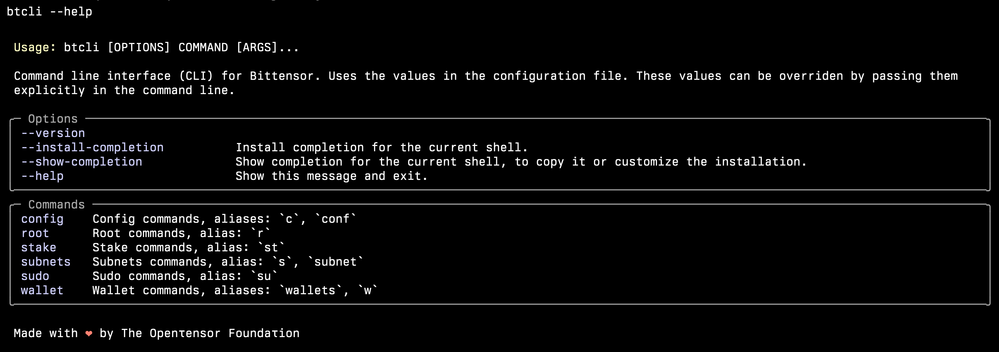

<div align="center">

# Bittensor CLI <!-- omit in toc -->
[](https://discord.gg/bittensor)
[](https://opensource.org/licenses/MIT) 
[](https://badge.fury.io/py/bittensor_cli)

---

## Internet-scale Neural Networks <!-- omit in toc -->

[SDK](https://github.com/opentensor/bittensor/tree/master) • [Wallet](https://github.com/opentensor/btwallet) • [Research](https://bittensor.com/whitepaper)

</div>

- [Documentation](#documentation)
- [Install on macOS and Linux](#install-on-macos-and-linux)
  - [Install from source](#install-from-source)
- [Install on Windows](#install-on-windows)
- [Verify the installation](#verify-the-installation)
- [Configuration](#configuration)
  - [Example config file](#example-config-file)
- [License](#license)

---

The Bittensor CLI, `btcli`, is a powerful command line tool for the Bittensor platform. You can use it on any macOS, Linux or WSL terminal to manage all common operations like creating a wallet, registering a subnet or a neuron, delegating your TAO, viewing Senate proposals and voting for them, and much more. Help information can be invoked for every command and option with `--help` option.



---

## Documentation

Installation steps are described below. For a full documentation on how to use `btcli`, see the [Bittensor CLI section](https://docs.bittensor.com/btcli) on the developer documentation site.

---

## Install on macOS and Linux

You can install `btcli` on your local machine directly from source, PyPI, or Homebrew. 
**Make sure you verify your installation after you install**.

### For macOS users
Note that the macOS preinstalled CPython installation is compiled with LibreSSL instead of OpenSSL. There are a number
of issues with LibreSSL, and as such is not fully supported by the libraries used by btcli. Thus we highly recommend, if 
you are using a Mac, to first install Python from [Homebrew](https://brew.sh/). Additionally, the Rust FFI bindings 
[if installing from precompiled wheels (default)] require the Homebrew-installed OpenSSL pacakge. If you choose to use
the preinstalled Python version from macOS, things may not work completely.


### Install from [PyPI](https://pypi.org/project/bittensor/)

Run 
```
pip install -U bittensor-cli
```

Alternatively, if you prefer to use [uv](https://pypi.org/project/uv/):
```
uv pip install bittensor-cli
```

### Install from [Homebrew](https://formulae.brew.sh/formula/btcli#default)

```shell
brew install btcli
```

### Install from source

1. Create and activate a virtual environment.

```bash
python3 -m venv btcli_venv
source btcli_venv/bin/activate
```

2. Clone the Bittensor CLI repo.

```bash
git clone https://github.com/opentensor/btcli.git
```

3. `cd` into `btcli` directory.

```bash
cd btcli
```

4.  Install


```bash
pip3 install .
```

### Also install bittensor (SDK)

If you prefer to install the btcli alongside the bittensor SDK, you can do this in a single command with

```
pip install -U bittensor[cli]
```

---

## Install on Windows

To install and run Bittensor SDK on Windows you must install [**WSL 2** (Windows Subsystem for Linux)](https://learn.microsoft.com/en-us/windows/wsl/about) on Windows and select [Ubuntu Linux distribution](https://github.com/ubuntu/WSL/blob/main/docs/guides/install-ubuntu-wsl2.md). 

After you installed the above, follow the same installation steps described above in [Install on macOS and Linux](#install-on-macos-and-linux).

**ALERT**: **Limited support on Windows for Bittensor operations**
While wallet transactions like delegating, transfer, registering, staking can be performed on a Windows machine using WSL 2, the subnet mining and subnet validating operations are not recommended and are not supported on Windows machines.

---

## Verify the installation

```bash
btcli --version
```

The above command will show you the version of the `btcli` you just installed.

---

## Configuration

You can set the commonly used values, such as your hotkey and coldkey names, the default chain URL or the network name you use, and more, in `config.yml`. You can override these values by explicitly passing them in the command line for any `btcli` command.

### Example config file

The default location of the config file is: `~/.bittensor/config.yml`. An example of a `config.yml` is shown below:

```yaml
network: local
use_cache: true
dashboard_path: null
disk_cache: false
rate_tolerance: null
safe_staking: true
wallet_hotkey: default
wallet_name: coldkey-user1
wallet_path: ~/.bittensor/wallets
metagraph_cols:
  ACTIVE: true
  AXON: true
  COLDKEY: true
  CONSENSUS: true
  DIVIDENDS: true
  EMISSION: true
  HOTKEY: true
  INCENTIVE: true
  RANK: true
  STAKE: true
  TRUST: true
  UID: true
  UPDATED: true
  VAL: true
  VTRUST: true
```

**For more help:**

```bash
btcli config --help
```

### ENV VARS
BTCLI accepts a few environment variables that can alter how it works:
 - USE_TORCH (default 0): If set to 1, will use torch instead of numpy
 - DISK_CACHE (default 0, also settable in config): If set to 1 (or set in config), will use disk caching for various safe-cachable substrate
calls (such as block number to block hash mapping), which can speed up subsequent calls.
 - BTCLI_CONFIG_PATH (default `~/.bittensor/config.yml`): This will set the config file location, creating if it does not exist.
 - BTCLI_DEBUG_FILE (default `~/.bittensor/debug.txt`): The file stores the most recent's command's debug log. 

---

## Debugging
BTCLI will store a debug log for every command run. This file is overwritten for each new command run. The default location
of this file is `~/.bittensor/debug.txt` and can be set with the `BTCLI_DEBUG_FILE` env var (see above section).

The debug log will **NOT** contain any sensitive data (private keys), and is intended to be sent to the developers
for debugging. This file contains basic information about the command being run, the config, and the back and forth of requests and responses
to and from the chain.

If you encounter an issue, and would like to save the file somewhere it won't be overwritten, run `btcli --debug`,
and set the save file location. We recommend doing this first before anything, and then starting your debugging with
us on our [Discord](https://discord.gg/bittensor), or by opening an issue on [GitHub](https://github.com/opentensor/btcli/issues/new) 
(where you can also upload your debug file).

---

## License
The MIT License (MIT)
Copyright © 2024 The Opentensor Foundation

Permission is hereby granted, free of charge, to any person obtaining a copy of this software and associated documentation files (the “Software”), to deal in the Software without restriction, including without limitation the rights to use, copy, modify, merge, publish, distribute, sublicense, and/or sell copies of the Software, and to permit persons to whom the Software is furnished to do so, subject to the following conditions:

The above copyright notice and this permission notice shall be included in all copies or substantial portions of the Software.

THE SOFTWARE IS PROVIDED “AS IS”, WITHOUT WARRANTY OF ANY KIND, EXPRESS OR IMPLIED, INCLUDING BUT NOT LIMITED TO THE WARRANTIES OF MERCHANTABILITY, FITNESS FOR A PARTICULAR PURPOSE AND NONINFRINGEMENT. IN NO EVENT SHALL THE AUTHORS OR COPYRIGHT HOLDERS BE LIABLE FOR ANY CLAIM, DAMAGES OR OTHER LIABILITY, WHETHER IN AN ACTION OF CONTRACT, TORT OR OTHERWISE, ARISING FROM, OUT OF OR IN CONNECTION WITH THE SOFTWARE OR THE USE OR OTHER DEALINGS IN THE SOFTWARE.
